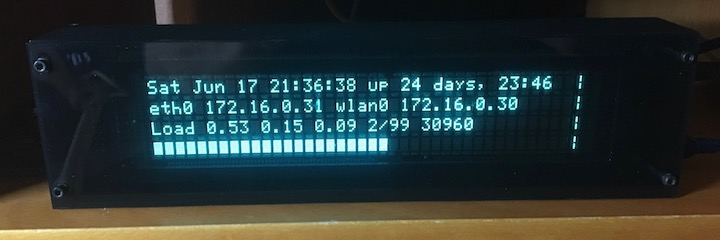
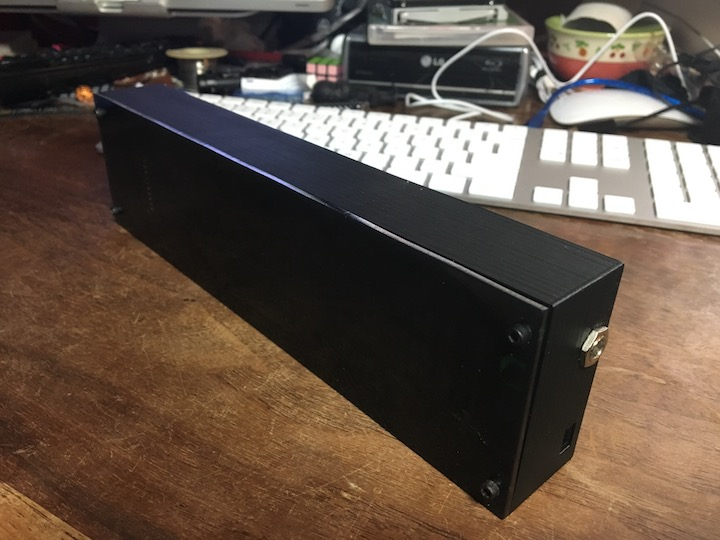

M404 Monitor
------------

The M404 monitor is a device to display status for a headless
Raspberry Pi (or any other computer with a USB port).

For more information see doc/design-notes.md.

The monitor is built around a Futaba M404SD01 Vacuum Fluorescent
Display (VFD) module. This module has a display of 40 characters by 4
lines. In addition to the VFD module, the monitor consists of:

1. A 3D printed case.

2. Laser-cut acrylic front and back covers.

2. An Arduino Nano that drives the VFD module.

3. A Python script that runs on the Raspberry Pi to gather data for
   display.

This project includes all the code, schematics, 3D models, and assembly 
information necessary to build and use an M404 monitor.

