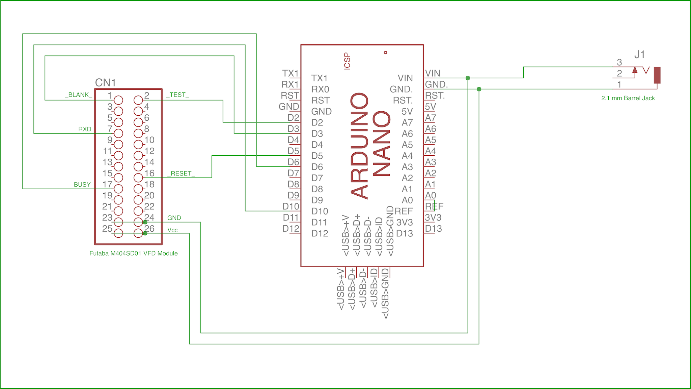
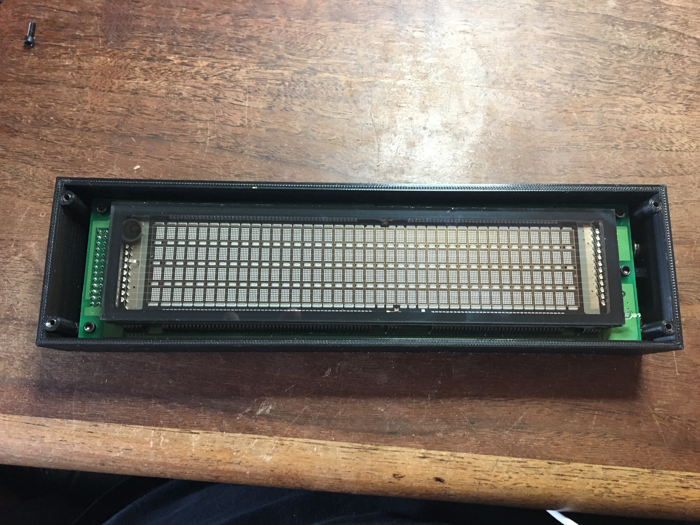
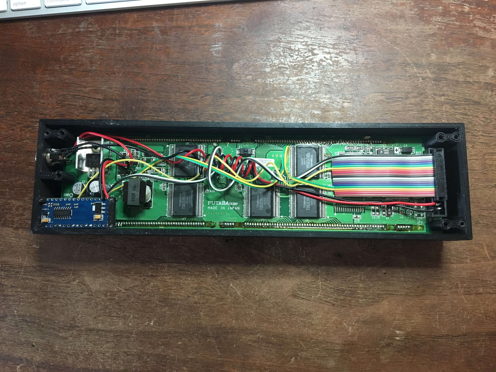
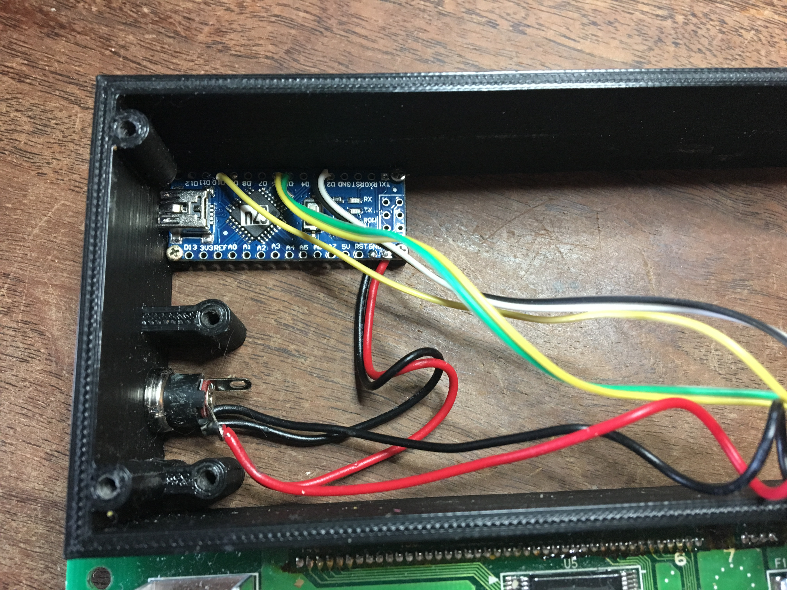
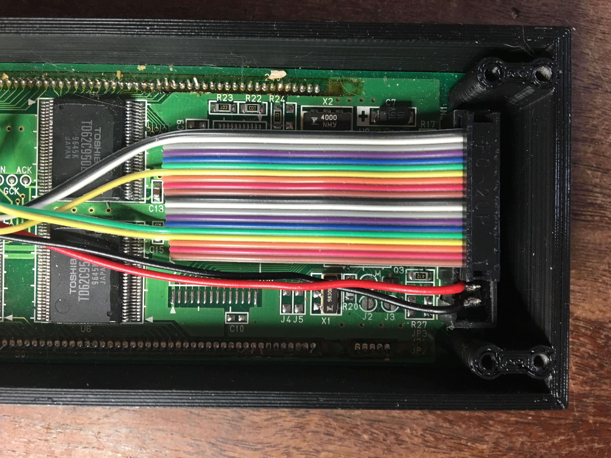

M404 Monitor
============

Introduction
------------

The M404 Monitor is a device to display status for a headless
Raspberry Pi (or any other computer with a USB port).

The monitor is built around a Futaba M404SD01 Vacuum Fluorescent
Display (VPN) module. This module has a display of 40 characters by 4
lines. In addition to the VFD module, the monitor consists of:

1. A 3D printed case.

2. Laser-cut acrylic front and back covers.

2. An Arduino Nano that drives the VFD module.

3. A Python script that runs on the Raspberry Pi to gather data for
   display.

3D Printed Case
---------------

The case was designed in Autodesk Fusion. The case is almost 10 inches
long and requires a printer with a fairly large print bed. I printed
mine on a re:3d Gigabot at the Jocelyn H Lee Innovation Lab at the
Freeman branch of the Harris County Public Library in Houston.

I have included an export of the Fusion project files, but should note
that I have never tried to work from an export (Fusion stores its
designs in the cloud, and I always work from these copies).

Also included is an STL model exported from Fusion. **IMPORTANT NOTE**:
when slicing the model for printing, it *MUST* be mirrored along the Y
axis (long axis) or the print will be unusable.

The 3D model files are in the 3d directory.

Laser-Cut Covers
----------------

Included is an SVG file that can be fed to a laser cutter to cut
covers for the case. The SVG file can be used for both the front and
back covers. I use 1/8" translucent grey acrylic for the front cover
and 1/8" opaque black acrylic for the back cover.

The SVG file is in the 3d directory with the STL file.

Arduino Nano
------------

The Nano was chosen for its small size and USB port. The Nano must be
attached to the case with small screws. Most nanos have header pins
soldered to them; these pins make the nano too large to fit in the
case. A nano *without* header pins must be used; these can be found on
Ebay. Wires for power (2) and connection to the VFD module (5) must be
soldered directly to the nano.

The case includes a small port to allow a mini-USB cable to be
attached. Display information is transmitted from the Raspberry Pi
over USB to the nano.

Two Aurdino programs are included:

In arduino/m404-demo is a demo program that displays Lewis Carroll's
poem Jabberwocky on the VFD module. This program can be used to test
the M404 monitor without requiring an external computer to transmit
information over the USB cable.

In arduino/m404-disp is the program that receives information over the
USB connection and drives it to the VFD module.

The reason for using an Arduino as an intermediary to drive the VFD
module, rather than connecting the Raspberry Pi directly to the VFD
module is twofold:

1. The VFD module uses an unusual baud rate and requires monitoring of
   its BUSY signal to keep from losing data.

2. The Arduino program uses a timeout to determine whether the
   Raspberry Pi or its script have stopped running. If a 10-second
   interval passes without any communication from the Raspberry Pi,
   the program will display a message reading "HOST NOT
   RESPONDING". This would not be possible if the Raspberry Pi were
   communicating directly to the VFD module.

Python
------

In the python directory are a pair of scripts that run on the
Raspberry Pi:

1. m404.py is a python script that gathers basic information from the
   Raspberry Pi: date/time, uptime, IP addresses for eth0 and wlan0,
   system load. This information is sent to the nano for display on
   the VFD module. System load is displayed both as text and load
   graph.

2. m404 is a shell script that can be installed in /etc/init.d; this
   allows the python script to be treated as a system service. As a
   system service, linux will automatically start the python script at
   boot, and it can be controlled with the 'service' command:
   e.g. `service m404 start`, `service m404 status`, etc.

Power
-----

A 1/4" hole must be drilled in the case to accept a 2.1mm barrel jack
for power. The hole is not included in the 3D model to allow some
end-user choice of exactly where to locate the jack. I put mine on the
same end of the case as the USB port.

Fasteners
---------

As mention above, four tiny screws are required to attach the Arduino
nano to the case. I didn't purchase these screws specifically for this
use, but found four screws in my small fastener collection (mostly
these come from old devices I've disassembled.

12 larger screws are required: four to attach the VFD module to the
case, and four each to attach the top and bottom covers. #4-40 screws
in 1/4" or 3/8" screws will work nicely. I prefer [socket cap, alloy
steel black oxide finish screws] [1] from Bolt Depot.

Schematic
---------

An Eagle project and schematic are included in the eagle directory
showing the connections required between the Arduino nano, VFD module,
and power jack.

Photos
------

The M404 monitor with the top cover removed:

The M404 monitor with the back cover removed:

Detail view of the Arduino nano from the bottom:

![Nano detail view back](photos/4-nano-bottom-detail.JPG

Detail view of the Arduino nano from the top, VFD module removed:

Detail view of the interface connector on the VFD module:

[1]: https://www.boltdepot.com/Socket_cap_Alloy_steel_black_oxide_finish_4-40.aspx?Selected=7872