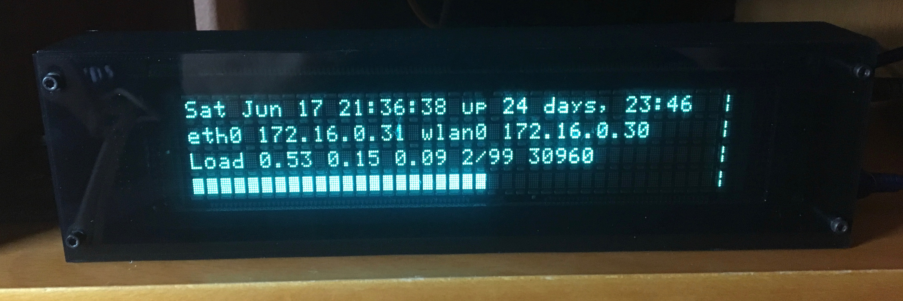

M404 Monitor
============

Introduction
------------

The M404 Monitor is a device to display status for a headless
Raspberry Pi (or any other computer with a USB port).

The monitor is built around a Futaba M404SD01 Vacuum Fluorescent
Display (VPN) module. This module has a display of 40 characters by 4
lines. In addition to the VFD module, the monitor consists of:

1. A 3D printed case.

2. Laser-cut acrylic front and back covers.

2. An Arduino Nano that drives the VFD module.

3. A Python script that runs on the Raspberry Pi to gather data for
   display.

3D Printed Case
---------------

The case was designed in Autodesk Fusion. The case is almost 10 inches
long and requires a printer with a fairly large print bed. I printed
mine on a re:3d Gigabot at the Jocelyn H Lee Innovation Lab at the
Freeman branch of the Harris County Public Library in Houston.

I have included an export of the Fusion project files, but should note
that I have never tried to work from an export (Fusion stores its
designs in the cloud, and I always work from these copies).

Also included is an STL model exported from Fusion. *IMPORTANT NOTE*:
when slicing the model for printing, it *MUST* be mirrored along the Y
axis (long axis).
